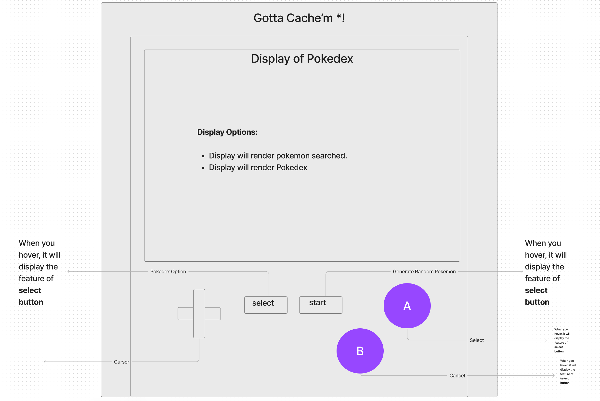

# User Stories

## As a user, I would like to be able to login to the page and have it remember my pokemon

- Use OAuth to allow the user to login to the page and store their pokemon in cache

## As a user, I would like to be able to search any of the original Pokemon in a search bar and retrieve information about them

- create a backend server that is connected to the pokemon API we are using, create a route that will allow the frontend to access all of the data stored in the API through the backend for the original Pokemon. Use the http verb 'get' to accomplish this.

## As a user, I would like the pokemon I search up to display in an organized and easy to read fashion

- We will have the information for each Pokemon display in a card with easy to read values

## As a user, I would like to have 6 pokemon and have the ability to trade them with other users

- Create a button that will randomly assign 6 pokemon to the user. create a database on mongodb and have it store an individuals pokemon and allow for post/update requests on behalf of the user when trading

## As a user, I would like to the page to have characteristics of the old gameboy color with some functionality

- Create a styling scheme which incorporates the old gameboy and use event listeners to create buttons which perform similar to tasks to the original game

